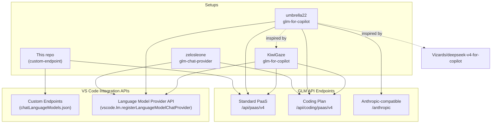

# GLM — Custom Endpoint vs VS Code Extensions

> Research record comparing the setup in this repo (`copilot-custom-endpoint` — direct, no proxy) against three third-party VS Code extensions that integrate GLM models as native language-model providers.
>
> **Current date:** July 1, 2026.

---

## Extensions Reviewed

| Extension                              | Author                        | Marketplace ID                             | GitHub                                                                          | Approach                                                |
| -------------------------------------- | ----------------------------- | ------------------------------------------ | ------------------------------------------------------------------------------- | ------------------------------------------------------- |
| **GLM Chat Provider**                  | Denizhan Dakılır (zelosleone) | _(pending/not listed)_                     | [zelosleone/glm-chat-provider](https://github.com/zelosleone/glm-chat-provider) | `vscode.lm.registerLanguageModelChatProvider("zai", …)` |
| **GLM for Copilot**                    | umbrella22 (ikaros)           | `ikaros.glm-for-vscode-copilot`            | [umbrella22/glm-for-copilot](https://github.com/umbrella22/glm-for-copilot)     | `vscode.lm.registerLanguageModelChatProvider("glm", …)` |
| **GLM Models for GitHub Copilot Chat** | KiwiGaze (yijiazhen-qi)       | `yijiazhen-qi.glm-for-github-copilot-chat` | [KiwiGaze/glm-for-copilot](https://github.com/KiwiGaze/glm-for-copilot)         | `vscode.lm.registerLanguageModelChatProvider("glm", …)` |

All three are MIT-licensed, community-built, and unaffiliated with Zhipu AI, Z.AI, GitHub, or Microsoft.

---

## TL;DR

- **All three extensions target the GLM Coding Plan** (`/api/coding/paas/v4`) as their primary (or only) endpoint. Our setup targets the **Standard Pay-as-You-Go** PaaS endpoint (`/api/paas/v4`) — the Coding Plan endpoint is [not usable from VS Code custom endpoints](../models/glm.md#quick-start).
- The extensions use VS Code's **native Language Model Provider API** (`vscode.lm.registerLanguageModelChatProvider`), which gives them first-class integration: reasoning blocks as collapsible `LanguageModelThinkingPart`, per-model `configurationSchema` dropdowns in the picker, token counting, and usage metadata reporting. Our custom-endpoint setup uses the simpler `chatLanguageModels.json` mechanism, which **discards reasoning content** and has no per-model UI controls.
- For **Pay-as-You-Go users** on `z.ai` or `bigmodel.cn`, our setup remains the simplest validated path — no extension install, no Coding Plan subscription needed, and the server-side `clear_thinking: true` default handles the missing-`reasoning_content` gap cleanly.
- For **Coding Plan subscribers**, any of the three extensions is a better choice than our setup — they surface the Coding Plan endpoint natively, render reasoning in collapsible blocks, and add quality-of-life features (usage dashboards, vision proxy, per-model thinking toggles).
- The two approaches are **complementary, not competing**. They target different billing SKUs and different VS Code integration depths.
- **Preferred extensions for PayG users** (linked from [`README.md`](../../README.md)):
  - ⭐ [`umbrella22/ikaros.glm-for-vscode-copilot`](#2-umbrella22glm-for-copilot-glm-for-copilot) — used for **GLM 5.2** and **GLM 5V Turbo**.
  - ⭐ [`KiwiGaze/yijiazhen-qi.glm-for-github-copilot-chat`](#3-kiwigazeglm-for-copilot-glm-models-for-github-copilot-chat) — used for **GLM 5.1**.
  - Both support **Standard Pay-as-You-Go** API keys. ⚠️ The `zelosleone` extension is **not applicable** for our use case since it is locked to a Coding Plan subscription.

---

## Side-by-Side At-a-Glance

| Dimension                | This repo (`copilot-custom-endpoint`)                                                | zelosleone `glm-chat-provider`                                                                                | umbrella22 `glm-for-copilot`                                                                                    | KiwiGaze `glm-for-copilot`                                                                         |
| ------------------------ | ------------------------------------------------------------------------------------ | ------------------------------------------------------------------------------------------------------------- | --------------------------------------------------------------------------------------------------------------- | -------------------------------------------------------------------------------------------------- |
| **Integration API**      | Custom Endpoints (`chatLanguageModels.json`, `vendor: "customendpoint"`)             | `vscode.lm.registerLanguageModelChatProvider("zai", …)`                                                       | `vscode.lm.registerLanguageModelChatProvider("glm", …)`                                                         | `vscode.lm.registerLanguageModelChatProvider("glm", …)`                                            |
| **Local processes**      | **No** — direct HTTPS                                                                | **No** — pure extension                                                                                       | **No** — pure extension                                                                                         | **No** — pure extension                                                                            |
| **Primary upstream**     | `https://api.z.ai/api/paas/v4` (Standard PaaS)                                       | `https://api.z.ai/api/coding/paas/v4` (Coding Plan)                                                           | `https://open.bigmodel.cn/api/coding/paas/v4` (Coding Plan, default)                                            | Both Coding Plan and Standard, selectable                                                          |
| **Auth**                 | Bearer token via `Chat: Manage Language Models` UI                                   | Bearer token via `GLM: Set API Key` → `SecretStorage`                                                         | Bearer token via `GLM: Set API Key` → `SecretStorage`                                                           | Bearer token via `GLM: Set API Key` → `SecretStorage`                                              |
| **Available models**     | 3: `glm-5.2`, `glm-5.1`, `glm-5v-turbo`                                              | 14: GLM-5.2 through GLM-4.5, plus vision models                                                               | 3 default: GLM-5.2, GLM-4.6V-Flash, GLM-5-Turbo; +custom                                                        | 5: GLM-5.2, 5.1, 5, 4.7, 4.5 Air; +custom                                                          |
| **Vision**               | ✅ Native on `glm-5v-turbo` (image + video)                                          | ✅ Native on vision models (GLM-5V-Turbo, 4.6V, 4.5V)                                                         | ✅ **Transparent Vision Proxy**: routes images to GLM-4.6V-Flash → text description → target model              | ❌ No vision handling (text-only models)                                                           |
| **Tool calling**         | ✅                                                                                   | ✅                                                                                                            | ✅ (128-tool cap, experimental tool-list stabilization)                                                         | ✅ (128-tool cap)                                                                                  |
| **Streaming**            | ✅ VS Code built-in                                                                  | ✅ SSE via OpenAI SDK                                                                                         | ✅ SSE via custom client                                                                                        | ✅ SSE via custom client                                                                           |
| **Thinking handling**    | `thinking: { type: "enabled" }` in `requestBody`; reasoning **discarded** by VS Code | Per-model `thinkingMode` dropdown in picker; `reasoning_content` → `LanguageModelThinkingPart` (proposed API) | Per-model **Thinking Effort** dropdown (`None`/`High`/`Max`); `reasoning_content` → `LanguageModelThinkingPart` | Per-model **Thinking Effort** dropdown (`None`/`High`/`Max`) for GLM-5.2; binary toggle for others |
| **Reasoning visibility** | ❌ Discarded                                                                         | ✅ Collapsible blocks (Insiders) or gracefully absent (Stable)                                                | ✅ Collapsible blocks                                                                                           | ✅ Collapsible blocks                                                                              |
| **`clear_thinking`**     | Server default `true` — auto-strips historical reasoning (perfect match for VS Code) | Not sent — relies on `reasoning_content` round-trip via proposed API                                          | Not needed — reasoning handled by provider API                                                                  | Not needed — reasoning handled by provider API                                                     |
| **Temperature**          | Static `temperature: 1.0` in `requestBody`                                           | Per-model preset dropdown (Balanced/Precise/Creative/Max/Custom)                                              | Per-model preset; `reasoningEffort` also sent for GLM-5.2                                                       | Per-model preset via `reasoning_effort` for GLM-5.2; binary `thinking` toggle for others           |
| **`top_p`**              | Static `0.95`                                                                        | Not sent by default                                                                                           | Not sent by default                                                                                             | Not sent by default                                                                                |
| **Region switching**     | Manual `url` edit in JSON                                                            | Single endpoint (Coding Plan international)                                                                   | Settings UI: `region` + `apiMode` + `endpoint` preset dropdown (6 presets)                                      | Settings UI: `region` + `apiMode`                                                                  |
| **Custom models**        | Manual JSON config                                                                   | ❌                                                                                                            | ✅ `glm-copilot.customModels` setting + `modelIdOverrides`                                                      | ✅ `glm-copilot.customModels` setting + `modelIdOverrides`                                         |
| **Usage tracking**       | None                                                                                 | Status bar request counter                                                                                    | Cost estimation per turn + status bar                                                                           | **Coding Plan quota dashboard**: session/weekly/web-search bars, reset countdowns, refresh         |
| **i18n**                 | English only                                                                         | English only                                                                                                  | **Full en/zh-cn** (README, settings, commands, errors, walkthrough)                                             | en/zh-cn for model descriptions and UI strings                                                     |
| **VS Code requirement**  | Any with Copilot Chat                                                                | `^1.120.0` + proposed `languageModelThinkingPart` API                                                         | 1.116+                                                                                                          | 1.116+                                                                                             |
| **Install effort**       | Edit JSON, set key via Command Palette                                               | Install from source/VSIX, run `GLM: Set API Key`                                                              | One-click from Marketplace                                                                                      | One-click from Marketplace                                                                         |
| **Tests**                | None (GLM has no proxy)                                                              | No test suite                                                                                                 | ✅ Vitest unit tests (config, models, request prep, vision)                                                     | ✅ Vitest unit tests (usage bar, usage panel, config, commands)                                    |
| **License**              | MIT (this repo)                                                                      | MIT                                                                                                           | MIT                                                                                                             | MIT                                                                                                |

---

## Detailed Extension Profiles

### 1. zelosleone/glm-chat-provider ("GLM Chat Provider") — ⚠️ Not applicable for our use case

**Same author as `kimi-lm-copilot-provider`** — Denizhan Dakılır. Architecture mirrors the Kimi extension closely.

**Key characteristics:**

- **Coding Plan only.** Base URL hardcoded to `https://api.z.ai/api/coding/paas/v4`. No Standard API support.
- **Widest model catalog.** 14 models registered: GLM-5.2 (on-off-effort), GLM-5.1/5/5-Turbo/4.7/4.7-Flash/4.7-FlashX/4.6 (on-off), GLM-4.6V/5V-Turbo (vision, on-off), GLM-4.5/4.5-Flash/4.5-Air/4.5V (always-on).
- **Three thinking support tiers** encoded per-model:
  - `on-off-effort` (GLM-5.2): picker shows Auto/High/Max/Disabled
  - `on-off` (5.1, 5, 4.7, etc.): picker shows Auto/Enabled/Disabled
  - `always-on` (4.5 series): picker shows "Always On" (read-only)
- **Proposed API dependency.** Uses `LanguageModelThinkingPart` (proposed) for reasoning rendering; falls back gracefully when unavailable.
- **No tests, no marketplace listing yet.** Source-only distribution as of July 2026.
- **Temperature presets:** Balanced (0.7), Precise (0.2), Creative (0.9), Max (1.0), Custom.
- **Auth:** `SecretStorage` + `AuthManager.getOrPromptApiKey()` flow.
- **Status bar:** Session request counter, resets every 5h.

**Verdict:** The most "by-the-book" implementation — clean model definitions, proper thinking-support taxonomy, faithful to the Kimi extension's architecture. Best for Coding Plan users who want the full GLM model catalog with per-model thinking controls. Not usable for Standard API users.

---

### 2. umbrella22/glm-for-copilot ("GLM for Copilot") — ⭐ Preferred for PayG

**The most feature-rich of the three.** Published on both VS Code Marketplace and Open VSX. References KiwiGaze and deepseek-v4-for-copilot as inspirations.

**Key characteristics:**

- **Default endpoint is domestic Coding Plan** (`open.bigmodel.cn/api/coding/paas/v4`), but supports all 6 preset combinations via a single `endpoint` dropdown: `china-coding`, `china-standard`, `china-anthropic`, `international-coding`, `international-standard`, `international-anthropic`.
- **Three default models:** GLM-5.2, GLM-4.6V-Flash, GLM-5-Turbo. Custom models via `glm-copilot.customModels`.
- **Transparent Vision Proxy** — the standout feature:
  - When an image is attached, the extension routes it to GLM-4.6V-Flash (or a configurable alternative) for description.
  - The text description is injected into the prompt for the target model (e.g., GLM-5.2).
  - Fallback chain: GLM-4.6V-Flash → VS Code/Copilot vision model → custom API endpoint.
  - Configurable via `GLM: Configure Vision Proxy` (webview panel with source selection, endpoint URL, model ID, API key).
  - This keeps GLM-5.2 focused on coding/reasoning while offloading multimodal extraction.
- **Thinking Effort control** per-model in the picker dropdown: None / High / Max (for GLM-5.2).
- **Team Mode (planned/in-progress):** A `.glm/team.md` file with YAML frontmatter for director/executor model routing. Phase 1 (prompt-only injection) documented; Phases 2–5 planned.
- **Cost visibility:** Estimates per-turn cost from official list prices (CNY for domestic, USD for international). Status bar shows latest turn and session total.
- **Debug modes:** `minimal` (token usage only), `metadata` (privacy-safe logs), `verbose` (full request dumps to disk).
- **Experimental tool-list stabilization:** Pre-activates VS Code virtual tools to keep the `tools` array stable across turns (improves cache-hit rate).
- **i18n:** Full English and Simplified Chinese for all UI surfaces.
- **Walkthrough:** Multi-step guided setup.
- **Tests:** Vitest unit tests for config, models, request preparation, and vision service.

**Verdict:** The most polished and feature-complete extension. The vision proxy is genuinely innovative — it solves the "text-only flagship + vision needed" problem that every GLM-5.2 user faces. Best for Coding Plan users (especially domestic/China) who want the richest feature set. The Team Mode roadmap suggests ambition beyond a simple model provider.

---

### 3. KiwiGaze/glm-for-copilot ("GLM Models for GitHub Copilot Chat") — ⭐ Preferred for PayG

**The most mature in terms of marketplace presence** (v0.2.7, CI badge, changelog, contribution guide). Originally launched with GLM-4.6 and GLM-4.5 Air; now tracks GLM-5.2.

**Key characteristics:**

- **Dual API support** as a first-class feature: Coding Plan and Standard API, each with International and China regions. The picker filters models by what your plan can serve.
- **Five built-in models:** GLM-5.2 (flagship, both plans), GLM-5.1 (Standard only), GLM-5 (Standard only), GLM-4.7 (both plans), GLM-4.5 Air (both plans).
- **Thinking Effort** for GLM-5.2: `none` → `thinking: { type: "disabled" }`, `high` → `{ type: "enabled" }` + `reasoning_effort: "high"`, `max` → `{ type: "enabled" }` + `reasoning_effort: "max"`. Binary toggle for other models.
- **Live Coding Plan usage tracking** — the standout feature:
  - Status bar shows session (5h rolling) quota percentage.
  - `GLM: Show Usage Details` opens a webview panel with session/weekly/web-search quota bars, reset countdowns, plan name, and renewal date.
  - Polls reverse-engineered z.ai usage endpoints (`/api/biz`, `/api/monitor`).
  - Auto-refreshes at configurable interval (default 15 min). Can be hidden.
  - International region only (China usage endpoints unverified).
- **Zero runtime dependencies.** Pure VS Code API + Node.js built-ins. Uses `fetch` (Node 20+) for HTTP.
- **Custom models + `modelIdOverrides`** for proxy/regional endpoint scenarios.
- **Settings fallback for API key** (`glm-copilot.apiKey` in `settings.json`) — documented for CI/automation but discouraged for regular use.
- **Well-documented:** README, `docs/glm-api.md`, `CONTRIBUTING.md`, `SUPPORT.md`, `SECURITY.md`, `CODE_OF_CONDUCT.md`, `llms.txt`, changelog.
- **pnpm** monorepo with Vitest unit tests, CI pipeline, release audit skill.
- **i18n:** en/zh-cn for model descriptions, error messages, and usage panel.

**Verdict:** The most "production-grade" of the three — good docs, CI, tests, marketplace distribution. The Coding Plan usage dashboard is genuinely useful for quota management. Best for users who want a well-maintained, dual-API extension with quota visibility. The Standard API support makes this the only extension that overlaps with our use case.

---

## How Our Setup Differs (All Three Extensions)

### 1. Two different VS Code provider APIs

- **All three extensions:** VS Code's native _Language Model Provider API_ — `vscode.lm.registerLanguageModelChatProvider("zai"|"glm", provider)`. Models participate in VS Code's native LM UI: token counting, token-budget tracking, `configurationSchema` dropdowns, usage metadata, and the proposed `LanguageModelThinkingPart` API.
- **Our setup:** The _Custom Endpoint_ feature (`vendor: "customendpoint"` in `chatLanguageModels.json`). Sufficient for chat, streaming, and tool calling, but **does not** support thinking-part round-trips, per-model UI controls, or usage metadata reporting.

### 2. Different upstream SKU (for zelosleone and umbrella22)

- **zelosleone/glm-chat-provider:** Hardcoded to Coding Plan endpoint (`/api/coding/paas/v4`). Standard API keys will not work.
- **umbrella22/glm-for-copilot:** Defaults to domestic Coding Plan but supports all 6 presets including Standard.
- **KiwiGaze/glm-for-copilot:** Dual API — explicitly supports both Coding Plan and Standard.
- **Our setup:** Standard PaaS only (`/api/paas/v4`). Coding Plan endpoint is [not usable from VS Code custom endpoints](../models/glm.md#quick-start) — it is locked to a curated list of officially supported tools.

### 3. Reasoning visibility — the biggest UX gap

This is the single most impactful difference:

| Scenario                   | Custom Endpoint (our setup)                                                                                 | All Three Extensions                                                                         |
| -------------------------- | ----------------------------------------------------------------------------------------------------------- | -------------------------------------------------------------------------------------------- |
| Plain chat (no tools)      | `reasoning_content` arrives via SSE but VS Code **discards it**                                             | `reasoning_content` → `LanguageModelThinkingPart` → **collapsible "Thinking" block** in chat |
| Agent mode (tools present) | `reasoning_content` auto-stripped by server (`clear_thinking: true` default) — no errors, but no visibility | Reasoning rendered as thinking blocks; survives tool turns via proposed API round-trip       |

**Net result:** With our setup, you never see GLM's reasoning. The model still thinks (thinking is `enabled`), and the server strips historical reasoning cleanly (so tool loops don't 400), but the reasoning is invisible. With any of the three extensions, reasoning appears as collapsible blocks inside Copilot Chat — you can see _why_ the model chose to read a file, run a command, or make an edit.

This is **not a fixable gap** on our side — it's a fundamental limitation of the `customendpoint` vendor. The custom-endpoint handler in VS Code does not recognize `reasoning_content` in SSE chunks and has no mechanism to emit `LanguageModelThinkingPart`. Only a native `LanguageModelChatProvider` can do this.

### 4. Thinking control UX

- **Our setup:** Static `thinking: { type: "enabled" }` in `requestBody`. To change thinking mode, you must edit `chatLanguageModels.json` and restart VS Code.
- **Extensions:** Per-model dropdown in the Copilot model picker — change thinking effort mid-conversation without editing config files. The picker shows `None` / `High` / `Max` for GLM-5.2 (umbrella22, KiwiGaze) or `Auto` / `Enabled` / `Disabled` for other models (zelosleone).

### 5. Model catalog

- **Our setup:** 3 models (GLM-5.2, GLM-5.1, GLM-5V-Turbo). You can add more by editing JSON.
- **zelosleone:** 14 models covering the full GLM lineup including legacy and vision models.
- **umbrella22:** 3 default (GLM-5.2, GLM-4.6V-Flash, GLM-5-Turbo) + unlimited custom.
- **KiwiGaze:** 5 models (GLM-5.2, 5.1, 5, 4.7, 4.5 Air) + unlimited custom. Filters by API mode.

### 6. Vision strategy

- **Our setup:** Native vision on `glm-5v-turbo` — the only model configured with `vision: true`. Images go directly to the multimodal model. GLM-5.2 and GLM-5.1 are text-only and will error on image input.
- **umbrella22:** Vision Proxy — images are described by GLM-4.6V-Flash first, then the description is sent to the text-only target model. This lets you use GLM-5.2 with images without switching models.
- **zelosleone:** Native vision on GLM-5V-Turbo, GLM-4.6V, GLM-4.5V — no proxy needed.
- **KiwiGaze:** No vision handling — all models are text-only.

The umbrella22 vision proxy is the most pragmatic approach for GLM-5.2 users who occasionally need image understanding.

---

## What Our Setup Has That the Extensions Don't

| Feature                              | Detail                                                                                                                                                                                |
| ------------------------------------ | ------------------------------------------------------------------------------------------------------------------------------------------------------------------------------------- |
| **No extension install**             | Pure `chatLanguageModels.json` config. Works on locked-down VS Code installs, air-gapped environments, or any VS Code variant that supports custom endpoints.                         |
| **No Coding Plan dependency**        | Works with any Z.ai Standard API key. The extensions either require Coding Plan (zelosleone) or default to it (umbrella22).                                                           |
| **`glm-5v-turbo` native vision**     | Our setup is the only one that configures `glm-5v-turbo` with `vision: true` for native multimodal — no proxy/description round-trip needed.                                          |
| **Full `requestBody` control**       | We can tweak `temperature`, `top_p`, `thinking`, and any other parameter without waiting for an extension update. Extensions have opinionated defaults.                               |
| **`clear_thinking: true` awareness** | Our docs explicitly document why the server default is a perfect match for VS Code's missing-`reasoning_content` behavior. Extensions work around this with the proposed API instead. |
| **Existing comprehensive docs**      | `docs/models/glm.md` is a full setup guide, configuration reference, troubleshooting table, and validation record maintained in-repo.                                                 |
| **Shared infrastructure pattern**    | GLM follows the same `chatLanguageModels.json` pattern as Qwen, MiMo, MiniMax, and DeepSeek — one mental model for all providers.                                                     |

---

## What Each Extension Has That We Don't

### From zelosleone/glm-chat-provider

| Feature                          | Description                                                                                           |
| -------------------------------- | ----------------------------------------------------------------------------------------------------- |
| **14-model catalog**             | Full GLM lineup from GLM-5.2 down to GLM-4.5V, including vision models                                |
| **Thinking support taxonomy**    | `on-off-effort`, `on-off`, `always-on` — per-model thinking capabilities encoded in model definitions |
| **Per-model picker dropdowns**   | Thinking mode and temperature selectable per model without editing config                             |
| **Collapsible reasoning blocks** | `LanguageModelThinkingPart` rendering via proposed API                                                |

### From umbrella22/glm-for-copilot

| Feature                                  | Description                                                                                                                      |
| ---------------------------------------- | -------------------------------------------------------------------------------------------------------------------------------- |
| **Transparent Vision Proxy**             | Routes images through GLM-4.6V-Flash → description → target model. Configurable with fallback chain                              |
| **6 endpoint presets**                   | `china-coding`, `china-standard`, `china-anthropic`, `international-coding`, `international-standard`, `international-anthropic` |
| **Anthropic protocol support**           | Can target `/anthropic` endpoints in addition to OpenAI-compatible                                                               |
| **Team Mode (planned)**                  | `.glm/team.md` with YAML frontmatter for director/executor model routing                                                         |
| **Per-turn cost visibility**             | Status bar estimates based on official list prices in correct currency                                                           |
| **Experimental tool-list stabilization** | Pre-activates VS Code tools to keep `tools` array stable for cache-hit optimization                                              |
| **Debug modes**                          | `minimal`, `metadata`, `verbose` with full request dumps                                                                         |
| **Full i18n**                            | English and Simplified Chinese throughout                                                                                        |
| **Open VSX publishing**                  | Available for VS Code forks (VSCodium, etc.)                                                                                     |

### From KiwiGaze/glm-for-copilot

| Feature                             | Description                                                                             |
| ----------------------------------- | --------------------------------------------------------------------------------------- |
| **Coding Plan usage dashboard**     | Webview panel with session/weekly/web-search quota bars, reset countdowns, plan details |
| **Dual API as first-class feature** | Coding Plan and Standard API both fully supported; picker filters models by plan        |
| **`reasoning_effort` for GLM-5.2**  | Sends `reasoning_effort: "high"` or `"max"` alongside `thinking: { type: "enabled" }`   |
| **Production-grade CI/CD**          | GitHub Actions CI, Vitest test suite, changelog, release audit skill                    |
| **Well-documented**                 | `docs/glm-api.md`, `CONTRIBUTING.md`, `SUPPORT.md`, `SECURITY.md`, `llms.txt`           |
| **Settings fallback for API key**   | `glm-copilot.apiKey` in `settings.json` for CI/automation (with appropriate warnings)   |

---

## Which Approach for Which User?

### Use our custom-endpoint setup if you…

- Have a **Z.ai Standard API key** (Pay-as-You-Go) and don't want a Coding Plan subscription.
- Want the **simplest possible setup** — no extension install, just JSON config.
- Need **`glm-5v-turbo` with native vision** (the only setup that configures it).
- Prefer **one mental model** for all providers (Kimi, Qwen, MiMo, MiniMax, DeepSeek, GLM — all via `chatLanguageModels.json`).
- Don't need to see the model's reasoning/thinking in chat.
- Are on a **locked-down VS Code install** where extensions can't be installed.

### Use zelosleone/glm-chat-provider if you…

- Have a **GLM Coding Plan** subscription and want the full 14-model catalog.
- Want per-model thinking mode and temperature controls in the picker UI.
- Like the Kimi extension's architecture and want the same pattern for GLM.
- Are comfortable building from source (no marketplace listing yet).

### Use umbrella22/glm-for-copilot if you…

- Have a **GLM Coding Plan** subscription (domestic China or international).
- Want the **Transparent Vision Proxy** — use GLM-5.2 with images without switching models.
- Need **Chinese (Simplified) UI** throughout.
- Want **cost visibility** per turn in the status bar.
- Are interested in the **Team Mode** roadmap (director/executor model routing).
- Want the most **feature-rich** option with debug modes and tool-list stabilization.

### Use KiwiGaze/glm-for-copilot if you…

- Want **both Coding Plan and Standard API** support in one extension.
- Need **Coding Plan quota tracking** — the usage dashboard is the killer feature.
- Prefer the **most mature, well-documented** extension with CI and marketplace distribution.
- Want `reasoning_effort` control for GLM-5.2 (None/High/Max) in the picker.
- Need custom models and model ID overrides for proxy scenarios.

---

## Upstream Endpoint Mapping

| Setup          | International (z.ai)                            | China (bigmodel.cn)                                     | Protocol           |
| -------------- | ----------------------------------------------- | ------------------------------------------------------- | ------------------ |
| **Our setup**  | `https://api.z.ai/api/paas/v4/chat/completions` | `https://open.bigmodel.cn/api/paas/v4/chat/completions` | OpenAI             |
| **zelosleone** | `https://api.z.ai/api/coding/paas/v4`           | _(not configured)_                                      | OpenAI             |
| **umbrella22** | `https://api.z.ai/api/coding/paas/v4`           | `https://open.bigmodel.cn/api/coding/paas/v4`           | OpenAI + Anthropic |
| **KiwiGaze**   | Both Coding and Standard on z.ai                | Both Coding and Standard on bigmodel.cn                 | OpenAI             |

---

## Recommendations for This Repo

### Worth adopting from the extensions

1. **Add more GLM models to `chatLanguageModels.json`.** The extensions expose GLM-5, GLM-5-Turbo, GLM-4.7, and GLM-4.5 Air. We could add these as optional entries for users who want them. (Low effort, just more JSON blocks.)

2. **Document the Coding Plan gap more prominently.** All three extensions target the Coding Plan, and users searching for "GLM VS Code" will find them first. Our `docs/models/glm.md` already explains why the Coding Plan is incompatible, but a cross-link from this research file would help.

3. **Consider a `reasoning_effort` parameter for GLM-5.2.** Both umbrella22 and KiwiGaze send `reasoning_effort` for GLM-5.2. Our setup sends `thinking: { type: "enabled" }` without effort control. Adding `reasoning_effort: "max"` to the GLM-5.2 `requestBody` could improve reasoning depth. (Needs validation — GLM-5.2 accepts `max`, `high`, `medium`, `low`, `minimal`, `none`; the API folds `low`/`medium` → `high` and `minimal`/`none` → skip thinking.)

### Not worth adopting

- **Vision Proxy pattern.** Our setup uses `glm-5v-turbo` for native vision. Adding a vision proxy would require a local service (or extension), undermining the zero-proxy simplicity.
- **Coding Plan endpoint support.** Structurally impossible from `chatLanguageModels.json` — the Coding Plan endpoint is tool-gated. This is a fundamental limitation, not a missing feature.
- **`LanguageModelThinkingPart` reasoning rendering.** Requires the native provider API — not available to custom endpoints. This is the one irreparable gap.

---

## Appendix: Extension Relationship Graph

---

## References

- [zelosleone/glm-chat-provider](https://github.com/zelosleone/glm-chat-provider) — GLM Chat Provider extension (MIT, Denizhan Dakılır)
- [umbrella22/glm-for-copilot](https://github.com/umbrella22/glm-for-copilot) — GLM for Copilot extension (MIT, ikaros)
- [KiwiGaze/glm-for-copilot](https://github.com/KiwiGaze/glm-for-copilot) — GLM Models for GitHub Copilot Chat extension (MIT, yijiazhen-qi)
- [docs/models/glm.md](../models/glm.md) — This repo's GLM setup guide and validation record
- [docs/research/kimi-vscode-extension.md](kimi-vscode-extension.md) — Comparable analysis for Kimi
- [docs/research/mimo-vscode-extension.md](mimo-vscode-extension.md) — Comparable analysis for MiMo
- [docs/research/minimax-vscode-extension.md](minimax-vscode-extension.md) — Comparable analysis for MiniMax
